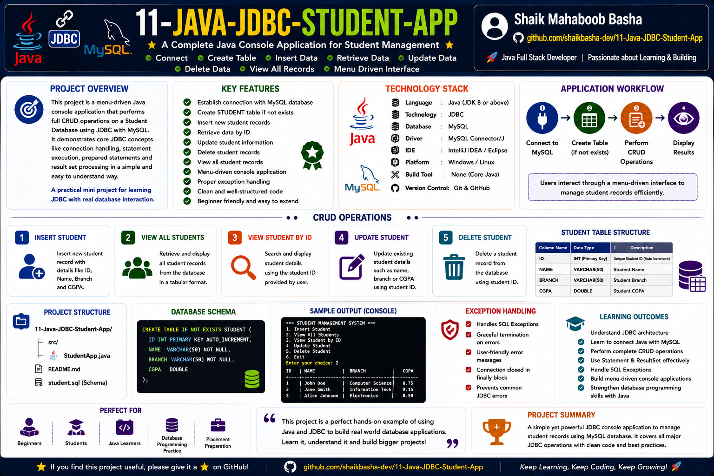

# Java JDBC Student App

## Project Overview

This project demonstrates how to map Java Object-Oriented Programming (OOP) objects to relational database records using **JDBC (Java Database Connectivity)** and **MySQL**.

The application creates Java objects containing student-related data and passes those objects to a dedicated JDBC persistence method. The method uses `PreparedStatement` to bind object field values to SQL placeholders and insert the data into a MySQL database table.

Instead of constructing SQL queries by directly combining values with query strings, the project uses parameterized SQL statements for cleaner, safer, and more structured database interaction.

The project demonstrates:

* Java Object-Oriented Programming
* Object-to-relational data mapping concepts
* JDBC database connectivity
* MySQL integration
* PreparedStatement
* Parameterized SQL queries
* Positional SQL placeholders
* Object field binding
* Record insertion
* SQL injection prevention concepts
* JDBC resource management
* SQLException handling
* Structured method-based database programming

This project provides a practical foundation for understanding how Java application objects can be persisted into relational database tables.

## Project Overview Infographic



## Project Features

This project provides:

* Creation of Java objects containing student data
* Object-based data management
* Java and MySQL database connectivity
* JDBC API implementation
* PreparedStatement-based SQL execution
* Parameterized INSERT queries
* Positional placeholder binding
* Object field to database column mapping
* Multiple object record insertion
* SQL injection prevention concepts
* Prepared query execution
* JDBC exception handling
* Structured persistence method
* Beginner-friendly JDBC implementation

## Technologies Used

* Java SE
* JDBC API
* MySQL
* SQL
* PreparedStatement
* MySQL Connector/J
* Git
* GitHub

## Application Workflow

The application follows the following object-to-database persistence workflow:

1. Start the Java application
2. Execute the `main()` method
3. Create Java `Demo` objects
4. Initialize object fields with student data
5. Pass each object to the `insertObject()` method
6. Configure MySQL database credentials
7. Establish a JDBC connection
8. Prepare the parameterized SQL query
9. Bind object values to SQL placeholders
10. Execute the prepared statement
11. Insert the object data into the database
12. Close JDBC resources
13. Display the successful processing message

The application workflow can be represented as:

```text
Java Application
        |
        v
    Demo Objects
        |
        v
 insertObject(Demo d)
        |
        v
     JDBC API
        |
        v
 PreparedStatement
        |
        v
  MySQL Database
```

## Method Registry and Technical Specifications

The project contains a model class and dedicated methods for controlling execution and database persistence.

| Component / Method | Context Scope | Input Parameter | Core Responsibility |
|---|---|---|---|
| `Demo` Class | Package-Private | Class Structure | Represents the object model containing student data fields |
| `main` Method | `public static` | `String[] args` | Creates Java objects and controls the application execution flow |
| `insertObject` | `public static` | `Demo d` | Connects to MySQL, prepares the SQL query, binds object values, and inserts the record |

## Demo Class

The `Demo` class acts as the Java object model used to store student-related information in memory.

The object contains the following fields:

* `roll`
* `name`
* `cgpa`

These fields represent the data that will later be mapped to columns in the relational database table.

Conceptual object structure:

```java
class Demo {

    int roll;
    String name;
    float cgpa;
}
```

The class acts as a simple data model for transferring values from Java application memory to the MySQL database.

## Main Method

The `main()` method acts as the application entry point and controls the runtime flow.

The method performs the following operations:

* Creates Java `Demo` objects
* Initializes object fields
* Stores student data in object instances
* Passes objects to the `insertObject()` method
* Handles SQL exceptions
* Displays the successful processing message

Example object data:

```text
Object d1
Roll Number : 1
Name        : Apple
CGPA        : 9.8

Object d2
Roll Number : 2
Name        : Banana
CGPA        : 9.3
```

The conceptual execution flow is:

```text
main()
   |
   +-- Create Demo Object d1
   |
   +-- Create Demo Object d2
   |
   +-- insertObject(d1)
   |
   +-- insertObject(d2)
   |
   +-- Display Success Message
```

## Object-to-Relational Data Mapping

The project demonstrates a basic object-to-relational data mapping concept.

Java object fields are mapped to relational database columns.

| Java Object Field | Database Column | Data Type |
|---|---|---|
| `roll` | `roll` | Integer |
| `name` | `name` | String / VARCHAR |
| `cgpa` | `cgpa` | Float |

The mapping flow can be represented as:

```text
Java Object
    |
    +-- roll  -----> Database roll Column
    |
    +-- name  -----> Database name Column
    |
    +-- cgpa  -----> Database cgpa Column
```

This concept demonstrates how application data stored in Java objects can be transferred into relational database records.

## PreparedStatement

The project uses the JDBC `PreparedStatement` interface instead of constructing raw SQL queries using string concatenation.

The SQL query uses positional placeholders:

```sql
INSERT INTO sample (roll, name, cgpa)
VALUES (?, ?, ?);
```

The `?` symbols represent placeholders for values that will be supplied during program execution.

The query structure is prepared before the object values are bound.

## Why PreparedStatement Is Used

`PreparedStatement` provides a structured approach for executing parameterized SQL queries.

The primary benefits include:

* Parameterized query execution
* Cleaner SQL handling
* Separation of SQL structure and values
* Reduced SQL injection risk
* Improved code readability
* Reusable SQL query structure
* Efficient execution for repeated operations
* Type-specific value binding

Compared with manually concatenating object values into SQL strings, `PreparedStatement` provides a safer and more maintainable database programming approach.

## Positional Placeholder Mapping

PreparedStatement placeholders are indexed starting from `1`.

The project binds object fields to SQL placeholders from left to right.

The mapping is:

| Placeholder Position | Java Value | PreparedStatement Method |
|---|---|---|
| `1` | `d.roll` | `setInt()` |
| `2` | `d.name` | `setString()` |
| `3` | `d.cgpa` | `setFloat()` |

Example binding:

```java
ps.setInt(1, d.roll);
ps.setString(2, d.name);
ps.setFloat(3, d.cgpa);
```

The mapping process is:

```text
SQL Query
INSERT INTO sample (roll, name, cgpa)
VALUES (?, ?, ?)
        |  |  |
        |  |  +---- Position 3 -> d.cgpa
        |  +------- Position 2 -> d.name
        +---------- Position 1 -> d.roll
```

Correct placeholder positioning is important because each value must correspond to the intended database column.

## insertObject Method

The `insertObject(Demo d)` method acts as the database persistence method.

It receives a `Demo` object as an input parameter.

The method performs the following operations:

* Defines the JDBC database URL
* Defines the database username
* Defines the database password
* Defines the parameterized INSERT query
* Establishes the MySQL connection
* Creates a PreparedStatement
* Binds the object fields to SQL placeholders
* Executes the INSERT operation
* Closes JDBC resources

Conceptual method structure:

```java
public static void insertObject(Demo d) throws SQLException {

    String url = "jdbc:mysql://localhost:3306/test";
    String user = "root";
    String password = "root";

    String query =
        "INSERT INTO sample (roll, name, cgpa) VALUES (?, ?, ?)";

    Connection con =
        DriverManager.getConnection(url, user, password);

    PreparedStatement ps =
        con.prepareStatement(query);

    ps.setInt(1, d.roll);
    ps.setString(2, d.name);
    ps.setFloat(3, d.cgpa);

    ps.executeUpdate();

    ps.close();
    con.close();
}
```

The method provides a dedicated database persistence layer for inserting Java object data into MySQL.

## JDBC Components Used

### DriverManager

`DriverManager` is responsible for establishing the database connection.

Example:

```java
DriverManager.getConnection(url, user, password)
```

### Connection

The `Connection` interface represents an active connection between the Java application and the MySQL database.

The connection is used to:

* Communicate with MySQL
* Prepare SQL statements
* Execute database operations

### PreparedStatement

The `PreparedStatement` interface represents a parameterized SQL statement.

It is used to:

* Prepare the SQL query
* Bind Java values
* Execute the INSERT operation

### executeUpdate()

The `executeUpdate()` method executes the SQL INSERT statement.

Example:

```java
ps.executeUpdate();
```

The method is commonly used for:

* INSERT
* UPDATE
* DELETE

## SQL Injection Prevention Concept

The project demonstrates an important security benefit of `PreparedStatement`.

When values are passed using methods such as:

```java
ps.setString(2, d.name);
```

the value is handled as a query parameter instead of being directly combined with the SQL query structure.

This reduces the risk of malicious input changing the intended SQL command.

The basic difference is:

```text
Raw Query Construction
        |
        v
SQL Structure + User Value Combined


PreparedStatement
        |
        v
SQL Structure Prepared Separately
        |
        v
Values Bound as Parameters
```

Using parameterized queries is a recommended JDBC practice for dynamic application data.

## Program Pseudocode Flow

```text
START

    ALLOCATE Demo Object d1

    SET d1.roll = 1
    SET d1.name = "Apple"
    SET d1.cgpa = 9.8


    ALLOCATE Demo Object d2

    SET d2.roll = 2
    SET d2.name = "Banana"
    SET d2.cgpa = 9.3


    TRY

        CALL insertObject(d1)

        CALL insertObject(d2)

        PRINT "Data pipeline processed. Records written successfully."

    CATCH SQLException

        PRINT SQL exception stack trace

    END TRY

END


SUBROUTINE insertObject(Demo d)

    SET database URL

    SET database username

    SET database password

    SET parameterized INSERT query


    OPEN database connection


    PREPARE SQL query


    BIND d.roll TO placeholder position 1

    BIND d.name TO placeholder position 2

    BIND d.cgpa TO placeholder position 3


    EXECUTE INSERT query


    CLOSE PreparedStatement

    CLOSE database connection

END SUBROUTINE
```

## Expected Output

When the MySQL server is running and the required database table is available, the application displays:

```text
Data pipeline processed. Records written successfully.
```

The Java object values are inserted into the MySQL database as separate records.

Conceptual database records:

| roll | name | cgpa |
|---|---|---|
| 1 | Apple | 9.8 |
| 2 | Banana | 9.3 |

## Exception Handling

The project handles database-related errors using `SQLException`.

Example structure:

```java
try {

    insertObject(d1);
    insertObject(d2);

} catch (SQLException e) {

    e.printStackTrace();
}
```

### SQLException

`SQLException` may occur because of:

* Incorrect database credentials
* Invalid JDBC URL
* MySQL Server not running
* Database connection failure
* Invalid SQL query
* Missing database table
* Incorrect column names
* Data type mismatch

### SQLSyntaxErrorException

A SQL syntax error may occur when:

* The target table does not exist
* A column name is incorrect
* The SQL statement contains invalid syntax

Example error:

```text
java.sql.SQLSyntaxErrorException:
Table 'test.sample' doesn't exist
```

The exception stack trace helps identify the database operation that caused the failure.

## Learning Outcomes

After understanding this project, learners can:

* Understand basic object-to-relational data mapping
* Create Java data objects
* Pass objects between Java methods
* Connect Java applications with MySQL
* Use JDBC Connection
* Use PreparedStatement
* Create parameterized SQL queries
* Understand positional SQL placeholders
* Bind Java object fields to SQL parameters
* Execute INSERT operations
* Understand SQL injection prevention concepts
* Handle SQLException
* Structure database persistence logic in a dedicated method

## Project Highlights

* Java OOP and JDBC integration
* Object-based student data representation
* Basic object-to-relational mapping concept
* Java and MySQL connectivity
* PreparedStatement implementation
* Parameterized INSERT query
* Positional placeholder binding
* Multiple Java object insertion
* SQL injection prevention concept
* Structured persistence method
* JDBC exception handling
* Beginner-friendly database programming project
* Suitable for JDBC and PreparedStatement revision

## Who Can Use This Project

This project is useful for:

* Java beginners
* JDBC beginners
* Java Full Stack Developer aspirants
* Backend development learners
* Database programming learners
* College students
* Freshers preparing for technical interviews
* Placement preparation
* Developers revising PreparedStatement concepts

## Author

**Shaik Mahaboob Basha**

B.Tech - Electronics and Communication Engineering

Aspiring Java Full Stack Developer

## Future Improvements

The project may be extended with:

* Complete Student CRUD Operations
* View All Student Records
* Search Student by ID
* Update Student Information
* Delete Student Records
* Menu-Driven Console Interface
* Student Model Class
* DAO Design Pattern
* Service Layer
* Try-With-Resources
* JDBC Transactions
* Batch Processing
* Connection Pooling
* Input Validation
* Custom Exception Handling

## Support

If this repository helps you in your learning journey, interview preparation, or future reference, please consider giving it a **Star ⭐**. Your support is greatly appreciated and motivates me to continue creating high-quality educational repositories.

## Conclusion

This project demonstrates how Java objects can be mapped to relational database records using JDBC, MySQL, and PreparedStatement. It covers object-based data representation, database connectivity, parameterized SQL queries, positional placeholder binding, object field mapping, record insertion, SQL injection prevention concepts, and JDBC exception handling.

The project provides a practical foundation for understanding Java object persistence and can be extended into a complete Student Management System with CRUD operations, menu-driven interaction, and structured application layers.

Happy Learning and Keep Coding!
